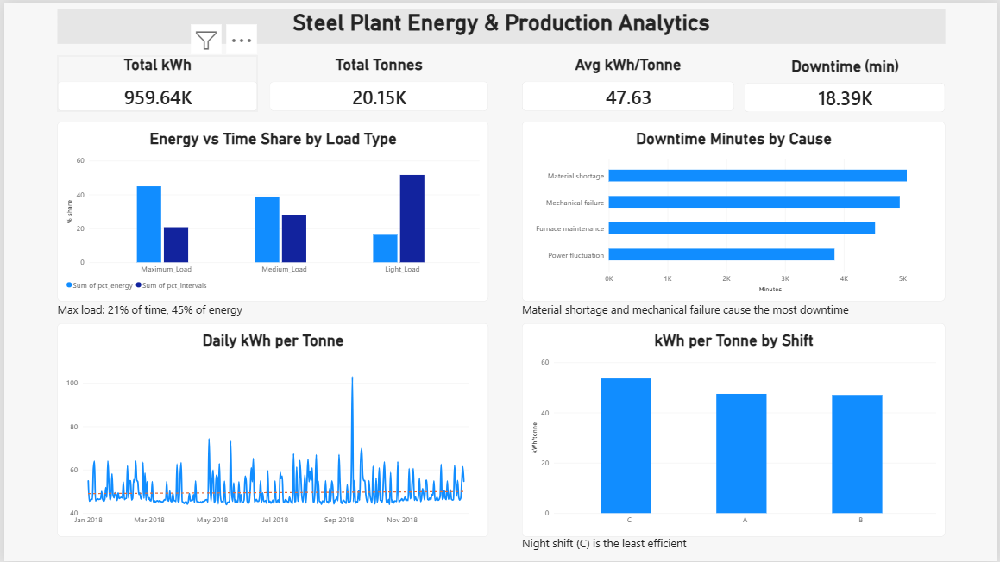
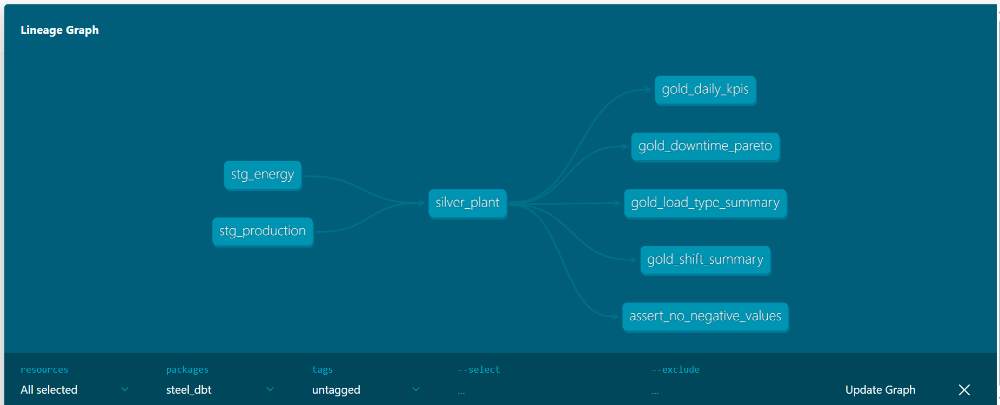
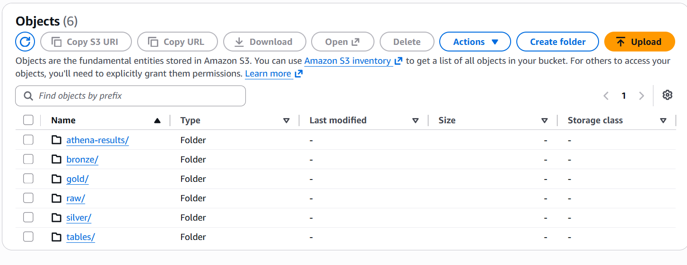
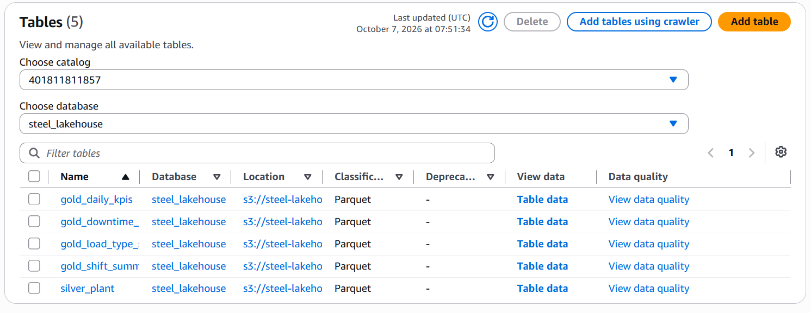
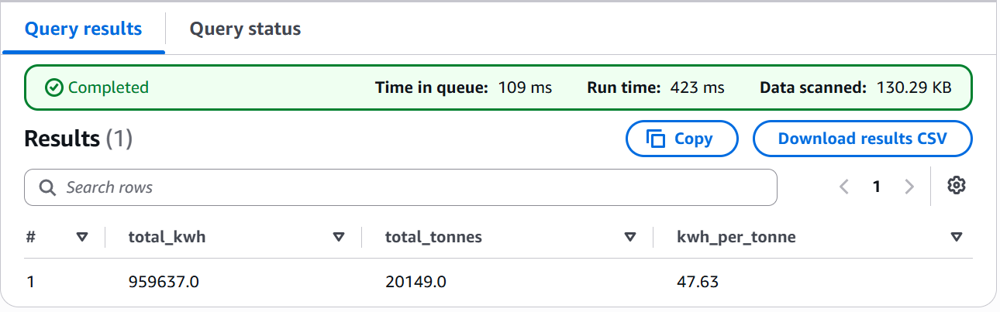
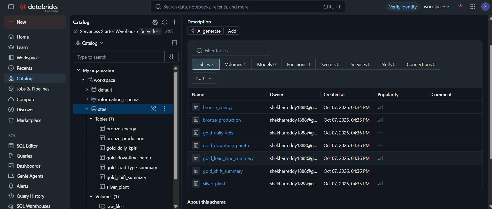
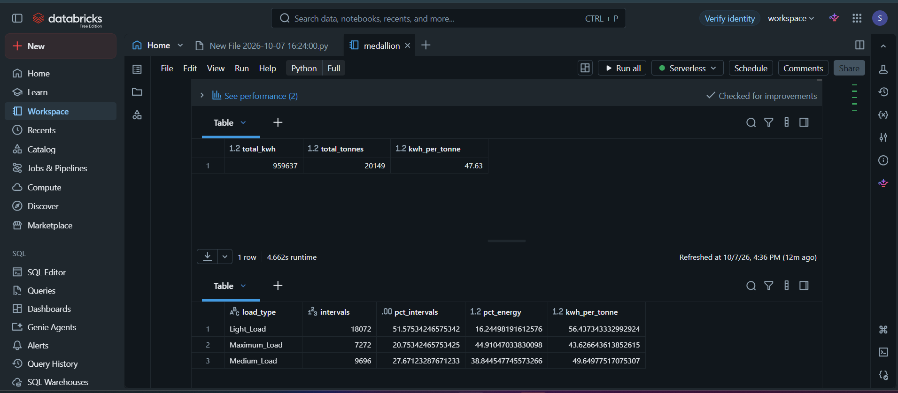
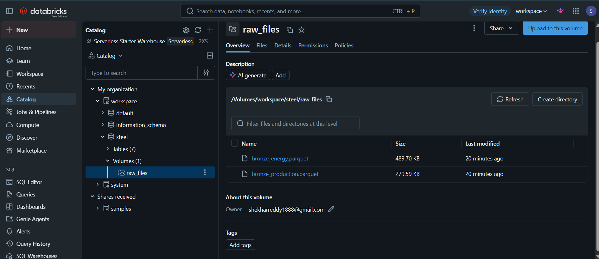

# Steel Plant Energy & Production Analytics Lakehouse

End-to-end data engineering project (medallion architecture) that combines **real** steel plant energy data with **simulated** production and sensor data to compute energy efficiency, downtime and quality KPIs. The same pipeline runs locally (DuckDB + dbt), on AWS (S3 + Glue + Athena) and on Databricks (Delta Lake).

## Architecture

```
Energy CSV (real, UCI) ─┐
                        ├─> Bronze ─> Silver ─> Gold ─┬─> Power BI dashboard
Simulator (production,  ─┘  (raw)     (clean,    (KPI  ├─> S3 + Glue + Athena (SQL on the lake)
sensors, downtime,                    joined)    marts) └─> Databricks Delta tables
defects)
```

| Layer | What happens |
|---|---|
| Bronze | Raw data loaded as-is, with ingestion timestamp |
| Silver | Deduplication, sensor anomaly flagging, type casting, shift derivation, join on timestamp |
| Gold | Daily KPIs, load-type summary, downtime Pareto, shift summary |

**Stack:** Python, pandas, DuckDB, dbt (dbt-duckdb), Parquet, AWS (S3, Glue, Athena), Databricks (Delta Lake, Unity Catalog), Power BI
**Planned:** streaming ingestion, orchestration, CI

## Data

- **Real:** [Steel Industry Energy Consumption](https://archive.ics.uci.edu/dataset/851) (UCI, CC BY 4.0). 35,040 records at 15-min intervals over 1 year.
- **Simulated:** production tonnage, furnace temperature, downtime events, defects. Generated by `simulator/simulate.py` with a fixed seed. Includes deliberate dirty data (duplicates, sensor spikes, missing values) to exercise the cleaning logic.

> Production figures are simulated, so efficiency numbers reflect the simulator's assumptions, not a real plant.

## Key findings

- Maximum_Load is ~21% of intervals but ~45% of energy consumption.
- Energy per tonne is ~23% worse at light load (56.4 kWh/t) than at max load (43.6 kWh/t).
- ~34,000 kWh was consumed during downtime, led by material shortage and mechanical failure.

Headline KPI (about 47.6 kWh per tonne) was cross-checked across four tools: Python/DuckDB, dbt, Athena and Databricks, plus the Power BI dashboard.

## Dashboard



## Data quality

- **Python pipeline:** fails on duplicate timestamps, null timestamps, negative energy, negative tonnage, or rows lost in the join.
- **dbt:** 13 tests, including unique and not-null on timestamps and dates, accepted values for load type and shift, and a custom test for negative energy/tonnage.

## dbt models and lineage



| Layer | Models |
|---|---|
| Staging (views) | `stg_energy`, `stg_production` |
| Silver (table) | `silver_plant` |
| Gold (tables) | `gold_daily_kpis`, `gold_load_type_summary`, `gold_downtime_pareto`, `gold_shift_summary` |

## Cloud: AWS S3 + Glue + Athena

Pipeline outputs are stored in S3 (raw, bronze, silver, gold). A Glue crawler catalogs one folder per table, and Athena queries them with SQL.





## Cloud: Databricks (Delta Lake)

`databricks/medallion.py` is a notebook that reads the bronze Parquet files from a Unity Catalog Volume, builds silver and gold as Delta tables, and verifies the KPI.





> **Note:** Databricks Free Edition limits access to external storage, so the bronze files were uploaded to a Volume instead of being read directly from S3. In a paid workspace the notebook would read from S3 through an external location.

## How to run

```bash
python -m venv venv
venv\Scripts\activate          # Mac/Linux: source venv/bin/activate
pip install pandas numpy duckdb pyarrow dbt-duckdb

# put the dataset CSV in data/raw/
python -m simulator.simulate data/raw/Steel_industry_data.csv
python -m pipeline.build data/raw/Steel_industry_data.csv
```

**dbt** (after the simulator has created `data/raw/production.csv`):

```bash
cd steel_dbt
dbt run
dbt test
dbt docs generate
dbt docs serve
```

**AWS:** `aws s3 sync data/<layer> s3://<your-bucket>/<layer>/`, then crawl with Glue and query in Athena.
**Databricks:** import `databricks/medallion.py`, upload the bronze Parquet files to the Volume, run all cells.

## Project structure

```
common.py              # shared loader
simulator/simulate.py  # production + sensor simulator
pipeline/build.py      # Python/DuckDB medallion pipeline
steel_dbt/             # dbt project (models, tests, docs)
databricks/            # Delta Lake notebook
bi/                    # Power BI dashboard (.pbix)
docs/                  # screenshots
data/                  # git-ignored
```

## Roadmap

- [x] Python + DuckDB medallion pipeline with quality checks
- [x] Power BI dashboard
- [x] dbt models + tests + docs
- [x] AWS S3 + Glue + Athena
- [x] Databricks Delta tables
- [ ] GitHub Actions CI (dbt run + test)
- [ ] Orchestration (Databricks Workflows / Airflow)
- [ ] Streaming ingestion (Kafka / Kinesis)